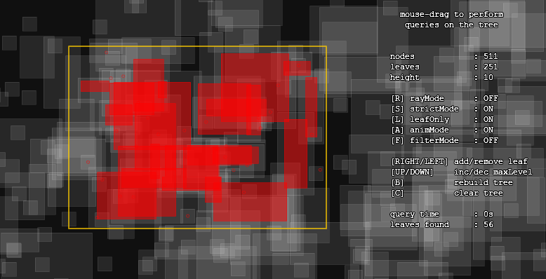

AABBTree
========

Haxe dynamic [AABB tree](http://en.wikipedia.org/wiki/Bounding_volume_hierarchy) for spatial partitioning and query.

 - fast insertion/removal/update
 - supports both AABB and raycast type of queries (with filtering callbacks)
 - easy to use and highly customizable (fattening factor, pool properties, insert strategies, etc.)
 - extendable debug renderer to visualize build steps
 - no dependencies

Check the [demo](https://dl.dropboxusercontent.com/u/32864004/dev/FPDemo/AABBTreeTest01.swf):




###BASIC USAGE EXAMPLE
```haxe
// instances of this class will be stored in the tree
class Entity
{
	public var id:Int = -1;   // id to interact with the tree
	public mbr:AABB;          // minimum bounding rect
	public var type:String;
	...
	public function new(type:String, x:Float, y:Float, width:Float, height:Float)
	{
		this.type = type;
		mbr = new AABB(x, y, width, height);
		...
	}
}

...

// create the tree and add a bunch of entities to it
var tree = new AABBTree<Entity>();
for (i in 0...50) {
	var type = (i % 1 == 0) ? "type_one" : "type_two"; 
	var entity = new Entity(type, some pos and size);
	entity.id = tree.insertLeaf(entity, entity.mbr.x, entity.mbr.y, entity.mbr.width, entity.mbr.height);
}

// update an entity (if its position or size changed)
tree.updateLeaf(entity.id, new pos and size);

// remove an entity
tree.removeLeaf(entity.id);

// get all entities in the tree
var entities = tree.getLeavesData();

// ... or walk through them
for (entity in tree) {
	do some stuff
}

// query the tree for entities overlapping the rect (x:-100, y:-100, w:200, h:200)
var results = tree.query(x, y, w, h);

// query the tree for entities _fully contained_ in the rect (x:-100, y:-100, w:200, h:200)
var results = tree.query(x, y, w, h, true);

// query the tree for entities intersecting the ray from (0, 0) to (100, 100) 
var results = tree.rayCast(0, 0, 100, 100);

// query the tree for entities intersecting the ray from (0, 0) to (100, 100) 
// use a callback for filtering by "type_two" and append results to prevResults array
function rayCallback(entity:Entity, id:Int):HitBehaviour {
	return (entity.type == "type_two") ? HitBehaviour.INCLUDE : HitBehaviour.SKIP;
} 

tree.rayCast(0, 0, 100, 100, prevResults, rayCallback);
```

###VALIDATION CHECKS
By default compiling in DEBUG mode will enable a series of tests to ensure the structure's validity (will affect performance), while in RELEASE mode they won't be executed.

You can force the validation by passing `-DTREE_CHECKS` to the compiler, or forcefully disable it with `-DNO_TREE_CHECKS`.

The `isValidationEnabled` property will be set consequently.

###CREDITS
The code is heavily inspired by the implementations of a dynamic AABB tree by 

 - Nathanael Presson 	(Bullet Physics - [http://bulletphysics.org](http://bulletphysics.org))
 - Erin Catto 			(Box2D - [http://www.box2d.org](http://www.box2d.org))

###LICENSE
This lib is developed by Giuseppe Di Mauro (azrafe7) and released under the MIT license. See the LICENSE file for details.
